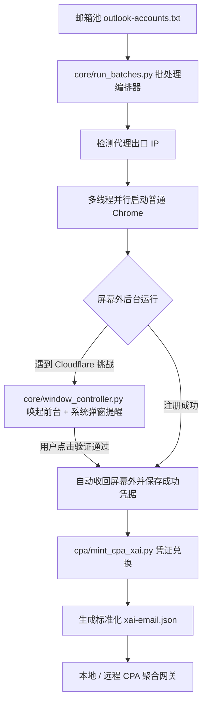

# ⚡ GK (Grok Pipeline & Account Toolchain)

<p align="center">
  <strong>现代化 Grok / xAI 账号全生命周期管理与自动化入库流水线</strong><br>
  人机协同过盾 · 屏幕外静默调度 · 动态出口监控 · CPA/Sub2API 凭据秒级兑换
</p>

<p align="center">
  
  
  
</p>

---

## 🌟 核心特性

- **🛡️ 极致的人机协同体验（Human-in-the-Loop）**：
  浏览器默认在屏幕外（`--window-position=-32000,-32000`）完全静默运行，杜绝弹窗干扰；仅当检测到 Cloudflare Turnstile 人机验证时，窗口控制器自动将对应窗口**单实例置顶唤起**并触发 Windows 系统通知，真人点击后自动收回屏幕外。
- **🚀 多窗口真并行编排（True Multi-Threading）**：
  突破传统单线程排队瓶颈，支持 5~10 线程并发跑批；内置出口 IP 探针，检测到 Clash / 代理节点切换后自动无缝续跑下一轮。
- **🔄 闭环凭据兑换（OIDC / SSO Minting）**：
  注册完成后一键将账号信息兑换为符合 **CLI Proxy API (CPA)** 与 **Sub2API** 规范的 `xai-<email>.json` 永久凭证。
- **🔒 企业级安全与脱敏设计（Zero Secrets in Code）**：
  所有服务器 IP、端口、SSH 密钥、代理地址及邮箱池数据全部外置，代码与数据物理隔离，开箱即可安全托管至 GitHub。

---

## 🏗️ 架构拓扑



---

## 📁 目录结构

```text
GK/
├── core/                        # 核心运行引擎
│   ├── run_batches.py           # 多轮批处理与自动换 IP 编排器
│   ├── run_multithread.py       # 多线程屏幕外浏览器引擎
│   ├── window_controller.py     # Win32 原生窗口调度器
│   └── notify.ps1               # Windows 桌面弹窗提醒脚本
├── cpa/                         # 凭证标准化与网关集成
│   ├── mint_cpa_xai.py          # SSO 凭据兑换 xAI OIDC 工具
│   ├── cpa_sync_helper.py       # 本地网关增量同步辅助
│   └── push_cpa_server.py       # 远程服务器安全推送脚本
├── tools/                       # 号池与健康度工具箱
│   ├── pool_quota_report.py     # 号池健康度与容量分析
│   └── mailbox_helper.py        # 邮箱池去重、清洗与批次分割
├── config/                      # 配置文件模板 (请勿提交真实配置)
│   ├── config.example.json      # 核心运行参数模板
│   └── server.example.json      # 服务器同步配置模板
├── output/                      # 运行时输出数据目录 (.gitignore 保护)
│   ├── mailboxes/
│   │   └── outlook-accounts.example.txt
│   └── cpa_auths/               # 生成的 xai-*.json 授权凭证
├── docs/                        # 说明文档
│   └── GROK_MODELS.md           # 实测模型规格与付费墙避坑指南
├── .gitignore                   # 严密的敏感数据忽略规则
├── requirements.txt             # 项目运行依赖
├── README.md                    # 项目说明
└── LICENSE                      # MIT 许可证
```

---

## 🚀 快速开始

### 1. 环境准备

推荐使用 Python 3.10+ 并安装依赖：

```bash
git clone https://github.com/Autumn8001/GK.git
cd GK
pip install -r requirements.txt
```

### 2. 准备配置

复制配置模板并根据实际情况调整：

```bash
cp config/config.example.json config/config.json
```

在 `config/config.json` 中配置你的本地代理（如 Clash 默认端口 `http://127.0.0.1:7897`）：

```json
{
  "outlook_accounts_file": "./output/mailboxes/outlook-accounts.txt",
  "proxy": "http://127.0.0.1:7897",
  "register_count": 5,
  "multi_thread_workers": 5,
  "turnstile_wait_timeout": 600
}
```

将待注册的邮箱放入 `./output/mailboxes/outlook-accounts.txt`（格式参考 `outlook-accounts.example.txt`：`邮箱----密码`）。

### 3. 运行批处理注册

启动自动化编排器：

```bash
python core/run_batches.py
```

- 浏览器将在屏幕外自动运行；
- 收到 Windows 桌面通知或听到提示音时，前台将弹出对应浏览器的验证界面，真人手动点击复选框即可；
- 验证完毕后窗口自动隐藏并保存注册结果；
- 一轮跑完后，切换代理节点，检测到新 IP 后将自动开始下一轮。

### 4. 兑换并推送 CPA 凭据

将注册成果一键兑换为 xAI 标准凭证：

```bash
# 兑换为本地 xai-*.json 凭据
python cpa/mint_cpa_xai.py

# (可选) 推送至远程生产服务器 CPA 网关
cp config/server.example.json config/server.json
python cpa/push_cpa_server.py --apply
```

---

## 📊 模型可用性参考

详见 [`docs/GROK_MODELS.md`](docs/GROK_MODELS.md)。免费凭证推荐使用支持推理强度的模型：
- `grok-4.7-xhigh`（深度思考旗舰）
- `grok-4.7`（通用高速度）
- `grok-4.6-xhigh`（稳定备用）

---

## ⚠️ 免责声明 (Disclaimer)

本项目仅用于网络协议研究、自动化测试与学术探讨。使用本项目时请严格遵守相关平台的使用条款（Terms of Service）与当地法律法规，严禁用于任何商业滥用或侵权行为。开发者不对因使用本工具造成的任何直接或间接后果承担连带责任。

---

## 📄 License

本项目基于 [MIT License](LICENSE) 开源。
